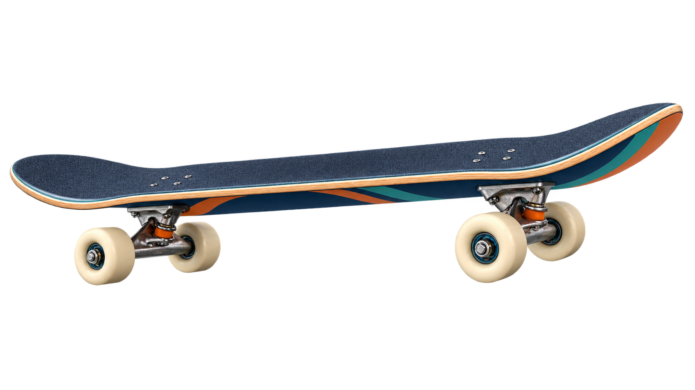

  

<h1 align="center">SKATE</h1>

<strong>Small Knowledge Architecture for Trusted Execution</strong>

  
  
  

  

SKATE turns workshop evidence into durable, connected memory that AI agents can actually use. It keeps the relevant context tight, preserves the receipts, and avoids dumping the whole filing cabinet into every prompt.

> **Before coffee:** Load all 800 notes and hope the model finds the answer.  
> **After coffee:** SKATE returns the six cards that matter. ☕🛹

## What the demo includes

- A draggable wheel with momentum physics.
- A five-stop SKATE walkthrough with a looping 3D Aberdeen board.
- Interactive raw-context versus SKATE chat examples.
- Live token comparisons showing context avoided.
- Responsive layouts and reduced-motion support.

## View locally

Double-click `index.html`. The experience works offline; internet access only improves the optional web fonts and README badges.

## Deploy on Vercel

Import this repository into Vercel and use:

- **Framework Preset:** Other
- **Build Command:** leave empty
- **Output Directory:** `.`

Every push to `main` will publish a fresh production deployment after the repository is connected.

## Update the GitHub site

Double-click `publish-to-github.bat`. It uploads only the approved site files to the `Aberdeen-Advisors/SKATE-site` repository. Git may open a browser the first time so you can sign in to GitHub.

## Project files

| File | Purpose |
|---|---|
| `index.html` | Complete SKATE site and interactions |
| `skateboard-3d.js` | Self-contained 3D board and renderer |
| `skateboard.png` | Static fallback board and README artwork |
| `favicon.png` | Browser and README icon |
| `THIRD-PARTY-NOTICES.txt` | Required third-party attribution |
| `vercel.json` | Static Vercel configuration |

---

<strong>Proprietary tech. Sick attitude. Zero decaf context windows.</strong>

© Aberdeen Advisors. SKATE product materials are proprietary. Third-party components remain under the terms listed in `THIRD-PARTY-NOTICES.txt`.
